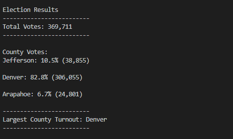
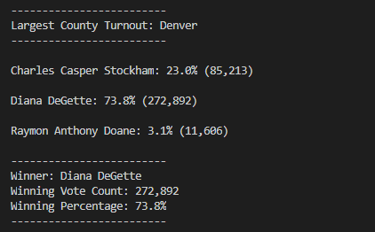
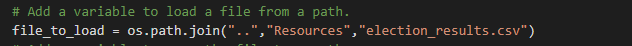

# Election_Analysis
This project was done as a way to audit election results from various counties. In order to complete the audit a python scrip ran through an Excel sheet containing all of the ballot information. This script counted the total number of votes, the various candidates who received votes, and the number of votes received by each and their percentage of the total vote as well as determining the winning candidate through the total vote and percentage vote and wrote the information out to a text file. However, in order to get a better understanding of the election a separate task was undertaken to determine where the various votes were coming from. In order to accomplish this additional coding was added to the base script that would track the voter turnout for each county, and from that the percentage of the total vote that the county in question accounted for, as well as the county with the highest turnout.

# County Results

* As we can see from the below screenshot of the terminal output the total votes cast in this congressional election was 369,711.
From the above screenshot we can furthermore see the breakdown of of the number of votes and percentage of total votes for each county in the precinct. Denver had by far the largest portion of the total vote coming in at 82.8% of the total vote with 306,055 of the votes coming from this district. Jefferson county had the next largest share of the total vote at 10.5% with 38,855 people casting votes for the candidates in this county. Finally, Arapahoe county had the smallest share of the total vote with only 6.7% of the 369,711 votes coming from this county, measuring in at 24,801 votes.

* As for the results for the candidates we can see from the screenshot below:

That the winner of the election by a large margin was Diane Degette (taking home 272,892 or 73.8% of the total vote). The runner-up was Charles Casper Stockham who had exactly 23% of the vote with 85,213 and the third place finisher was Raymon Anthony Doane who had only 3.1% of the vote with 11,606 votes.

# Conclusion

This code can be easily applied to future elections. Because the code was written to read from an Excel file it can easily be repurposed for any future elections with minimal modifications. By simply changing the following code snippet:

to accurately reflect the new document name the code will be able to read through the document adding the votes, county names and candidate names as it goes provided the Excel document is formatted in the same way as the original one.

One potential problem that might arise in future elections however the might necessitate a more serious change in code is if the candidate count grows too large. In this particular election only three candidates were chosen in the three counties, this is unlikely to be the case in other elections where many more candidates are likely to be chosen from. In order to combat this it should be a simple process to simply edit the code to only display candidates who received a certain portion of the vote. The code is already written so as to calculate the percentage of the total vote that each candidate received so it should be a simple matter to add in some code that would filter the final result to candidates who received more than five percent of the total vote, or whatever the best cutoff point for the election in question might be.
